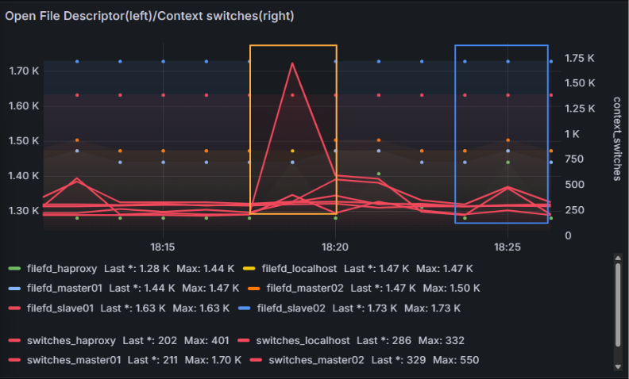

<br>

<h1 align="center" style="color: #FFD675;">🍽️ PickCook </h1>

<div align="center">
  
</div>


<h3 align="center">5팀 - Team CookBuddy </h3>


## 🕵️ 팀원 소개

<div align="center">

|      |      |   |    |     
| :--------------------------------------------------------: | :--------------------------------------------------------: | :--------------------------------------------------------: | :------------------------------------------------------: | :----------------------------------------------------------: 
| 🐰 **김아영**<br/>[@thay123028](https://github.com/thay123028) | 🧶 **김영재**<br/>[@young1042](https://github.com/young1042) | ⚽ **허정빈**<br/>[@jeongbin5211](https://github.com/jeongbin5211) | 🤪 **허정우**<br/>[@JohnHeo81](https://github.com/JohnHeo81) | 🐢 **홍서연**<br/>[@seoyeon22](https://github.com/seoyeon22)

</div>
<br>


## 🍕 프로젝트 소개
PickCook은 냉장고 속 재료를 등록해 재고와 유통기한을 관리하고, 그 재료로 만들 수 있는 요리를 추천해주는 플랫폼입니다. 만들고 싶은 요리를 고르면 필요한 재료도 알려주고, 부족한 재료는 바로 구매할 수 있어 요리가 더 쉬워집니다.

<br>

## 🍔 기술 스택


<br>

## 🌭 프로젝트 기획안

[프로젝트 기획안](https://docs.google.com/document/d/1JnNK9_vFxRizyXFUWUOrr1eKcOqdAXpH/edit?usp=sharing&ouid=105575553151863966937&rtpof=true&sd=true)

<br>

## 🍣 요구사항 정의서

[요구사항 정의서](https://docs.google.com/spreadsheets/d/1-NKiu4zpKw2Tl4Qjumd1SISX_odnlNEE/edit?usp=sharing&ouid=105575553151863966937&rtpof=true&sd=true)

<br>


## ERD

[ERD 다이어그램](https://www.erdcloud.com/d/i9Qf2BLnaAYZ4dCrH)


## 시스템 아키텍처


## 🍩 재해 복구 (DR)

<details>
  <summary><b>양방향 레플리케이션 방식을 사용한 이유</b></summary>
  <div markdown="1">
  <br>

  **✔️ 데이터 일관성 유지**
    
  레플리케이션은 Master 서버에서 발생하는 데이터 변경 사항을 실시간 또는 거의 실시간으로 Slave 서버에 자동 복제한다. 이를 통해 항상 최신 상태의 데이터를 보조 서버에 유지할 수 있다.

  <br>

  **✔️ 부하 분산**

   실시간 트래픽이 급증하는 상황에도 여러 서버로 분산 처리하여 성능이 저하하는 것을 방지하고, 안정적인 응답 속도를 유지할 수 있다.

  <br>

  **✔️ 읽기 작업에 강한 구조**

  서비스 특성 상 레시피, 커뮤니티 등 데이터 읽기 작업이 많은 환경이기 때문에, 다수의 슬레이브 서버가 작업을 처리하게 설계하여 높은 읽기 성능을 제공한다.

  <br> 

  **✔️ 고가용성**

  한쪽 마스터에 장애가 발생하더라도, HAProxy가 정상적인 서버로 트래픽을 분배하여 서비스 중단 없이 시스템을 지속적으로 동작할 수 있다.  
  
  <br>
  
  **✔️ 확장성**

  마스터 서버에 새로운 슬레이브 서버를 연결하여 쉽게 확장할 수 있어, 트래픽이 증가할 때 유연하게 대처가 가능하다.

  </div>
</details>

<br>
<details>
  <summary><b>장애 복구 시나리오</b></summary>
  <div markdown="1">
  <br>

**✔️ 마스터 1대 장애 발생 시**
  - HAProxy가 장애 난 마스터 노드를 감지하고, 해당 노드로의 쓰기 트래픽을 자동으로 차단
  - 클라이언트는 정상 마스터를 통해 쓰기, 슬레이브를 통해 읽기 요청을 지속 처리 가능
  - 장애 발생한 마스터 노드는 복구 시 슬레이브로 초기화한 뒤, 살아 있는 마스터에서 복제를 받아 데이터 동기화
  - 동기화 완료 후 필요 시 다시 마스터로 승격하고, 양방향 복제 재구성
  - HAProxy 설정을 갱신하여 복구된 노드에도 트래픽을 분산하도록 재설정

<br>

**✔️ 슬레이브 1대 장애 발생 시**
  - HAProxy가 장애 슬레이브를 감지하고, 해당 슬레이브로의 읽기 요청을 차단
  - 클라이언트는 정상 슬레이브 또는 마스터로부터 읽기 처리 가능
  - 슬레이브 복구 후, 마스터로부터 복제 설정 재구성하여 자동 동기화
  - 복구 완료 후 HAProxy가 해당 슬레이브로 다시 읽기 트래픽 분산

<br>

**✔️ 마스터 + 슬레이브 한 쌍(2대) 동시 장애 시**
  - HAProxy는 남은 마스터와 슬레이브 쌍으로 모든 트래픽을 집중 처리
  - 복구된 노드는 순차적으로 클러스터에 재투입, 살아 있는 마스터에서 복제를 통해 최신 상태로 동기화
  - 전체 클러스터 복원 후 HAProxy 설정을 통해 트래픽 분산 정상화

<br>

**✔️ 전체 장애 예방 및 대비 방안**
  - 모든 노드는 Prometheus + Alertmanager 등으로 모니터링하여 이상 조기 감지
  - 정기적인 자동 백업 및 스냅샷 관리로 데이터 손실 방지
  - 이중화된 HA 구성 (예: HAProxy + Keepalived)으로 프록시 서버 자체 장애도 대비

  <br>
  </div>
</details>
<br> 

## 🥨 SQL

#### ✅ DDL
[DDL SQL 파일](/sql/DDL.sql)


#### ✅ DML
[DML SQL 파일](/sql/DML.sql)

<br>

<details>
  <summary><b>회원</b></summary>
  <div markdown="1">

  닉네임 중복확인 
  

  <br>

  이메일 중복확인 (이메일 인증 전에 중복 체크)
  
  
  회원가입  
  

  <br>

  일반 로그인
  

  <br>
    
  회원 정보 수정  
  

  <br>
  
  회원 탈퇴 (Soft Delete 방식)  
  

  <br>
  </div>
</details>
<br>

<details>
  <summary><b>레시피 조회</b></summary>
  <div markdown="1">

  좋아요 많은 순으로 정렬 
  

  <br>

  최신순으로 정렬
  
  
  조리 시간 짧은 순  
  

  <br>

  난이도 쉬움 -> 어려움 순
  

  <br>
    
  레시피 단계별 설명  
  

  <br>
  
  이 레시피에 사용된 재료
  

  <br>
  </div>
</details>
<br>

<details>
  <summary><b>게시글 조회</b></summary>
  <div markdown="1">

  게시글 상세 조회 
  

  <br>

  게시글 댓글 조회
  
  
  <br>
  </div>
</details>
<br>
<details>
  <summary><b>게시글 조회</b></summary>
  <div markdown="1">

  재료 이름으로 게시글 검색
  

  <br>

  음식 이름으로 게시글 검색
  
  
  <br>
  </div>
</details>

<br>

## SQL 성능 개선

<details>
<summary>성능 개선 사례</summary>
<div markdown="1">

## ✅ 성능 개선 사례: `nickname` 컬럼 반정규화를 통한 조회 성능 향상

### 📌 배경

기존에는 게시글 목록을 조회할 때 작성자의 닉네임을 가져오기 위해 `boards` 테이블과 `users` 테이블을 조인(JOIN)해야 했습니다.

```sql
SELECT b.board_id, b.title, u.nickname
FROM boards b
JOIN users u ON b.user_id = u.user_id
WHERE b.user_id = ${__Random(0,10000)}
ORDER BY b.created_at DESC
LIMIT 20;
```

이 쿼리는 사용자 수와 게시글 수가 많아질수록 JOIN 비용이 증가하며, 부하 테스트(JMeter) 결과 응답 시간이 길어지는 현상이 발생했습니다.

---

### 🔧 개선 내용

`boards` 테이블에 `nickname` 컬럼을 직접 추가하여, 작성 시점의 사용자 닉네임을 함께 저장하는 방식으로 **반정규화(denormalization)**를 적용했습니다.

```sql
SELECT board_id, title, user_nickname
FROM boards
WHERE deleted_at IS NULL
ORDER BY created_at DESC
LIMIT 20;
```

---

### ✅ 개선 효과

- **JOIN 제거로 인한 쿼리 응답 속도 향상 (JOIN → 단일 테이블 조회)**
- JMeter 테스트 결과 TPS(초당 처리량) 증가, 평균 응답 시간 감소
- 단일 테이블 인덱스 활용 극대화

---

### ⚠️ 고려사항

- 사용자 닉네임이 변경될 경우 `boards.nickname`도 함께 업데이트되어야 하며, 이는 추가적인 동기화 처리(예: 트리거나 애플리케이션 레벨 처리)가 필요합니다.
- 데이터 중복이 발생하지만, 읽기 성능이 중요한 시나리오에서는 충분한 trade-off로 판단됩니다.
<div>
</details>